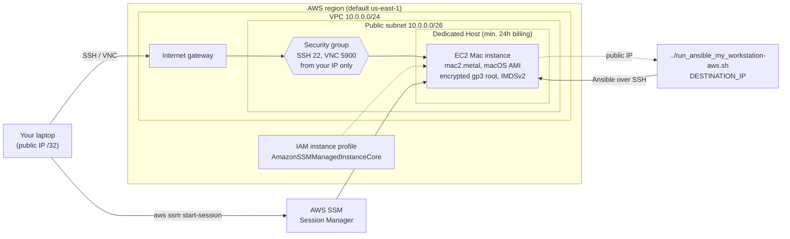

# EC2 Mac Test Instance

Terraform configuration that creates a macOS EC2 instance (Apple silicon) in
AWS. Use it to test the Ansible playbook in this repository against a clean
macOS machine.

## What It Creates

- VPC with one public subnet and no NAT gateway, so networking costs nothing
- Security group that allows SSH (22) and VNC (5900) only from your current
  public IP
- EC2 key pair from your local SSH public key
- Dedicated Host for the selected Mac instance type
- EC2 Mac instance using the latest Apple silicon macOS AMI with:
  - an encrypted `gp3` root volume
  - IMDSv2 required
  - an IAM instance profile for SSM Session Manager
- An admin macOS user named after your local `$USERNAME` / `$USER`, with your
  SSH key and a random password
- Screen Sharing (VNC) enabled
- Preinstalled Homebrew and its cask apps removed, giving a clean macOS



After the instance is created, Terraform writes its public IP to
`DESTINATION_IP` in `../run_ansible_my_workstation-aws.sh`.

## Costs

> [!WARNING]
> EC2 Mac instances need a Dedicated Host. AWS bills it for **at least 24
> hours**, and then per second until you release it.

The default `mac2.metal` (M1) host costs 0.65 USD/hour, which is
**15.60 USD minimum** in `us-east-1`, `us-east-2` and `us-west-2`. Prices for
other instance types are listed in [`variables.tf`](variables.tf).

## Requirements

- [Terraform](https://developer.hashicorp.com/terraform) >= 1.10
- AWS credentials with permissions for EC2, VPC and IAM
- SSH public key, by default `~/.ssh/id_ed25519.pub`
- [Session Manager plugin](https://docs.aws.amazon.com/systems-manager/latest/userguide/session-manager-working-with-install-plugin.html)
  for the AWS CLI (optional, only needed for SSM access)

## Usage

```bash
terraform init
terraform apply
```

macOS takes several minutes to boot after `apply` finishes.

### Connect

```bash
# SSH
eval "$(terraform output -raw ssh_command)"

# Screen Sharing from a macOS laptop
terraform output -raw user_password
eval "$(terraform output -raw vnc_command)"

# SSM Session Manager
eval "$(terraform output -raw ssm_session_command)"
```

### Run the Ansible Playbook

```bash
cd ..
./run_ansible_my_workstation-aws.sh
```

### Destroy

```bash
terraform destroy
```

AWS may refuse to release the Dedicated Host within 24 hours of allocation. If
`destroy` fails, run it again after the 24-hour period ends.

## Inputs

| Name                  | Description                   | Default                 |
|-----------------------|-------------------------------|-------------------------|
| `region`              | AWS region                    | `us-east-1`             |
| `name`                | Name prefix for all resources | `macos`                 |
| `instance_type`       | EC2 Mac instance type         | `mac2.metal`            |
| `root_volume_size`    | Root EBS volume size in GiB   | `100`                   |
| `ssh_public_key_path` | Path to the SSH public key    | `~/.ssh/id_ed25519.pub` |
| `tags`                | Tags applied to all resources | `Project`, `ManagedBy`  |

## Outputs

| Name                  | Description                                  |
|-----------------------|----------------------------------------------|
| `instance_id`         | EC2 Mac instance ID                          |
| `public_ip`           | Public IP address of the instance            |
| `dedicated_host_id`   | Dedicated Host ID                            |
| `allowed_cidr`        | Only source IP allowed to reach the instance |
| `ami_name`            | macOS AMI used                               |
| `ssh_command`         | SSH command                                  |
| `vnc_url`             | Screen Sharing URL                           |
| `vnc_command`         | Command to open Screen Sharing on macOS      |
| `user_password`       | macOS user password (sensitive)              |
| `ssm_session_command` | SSM Session Manager command                  |
